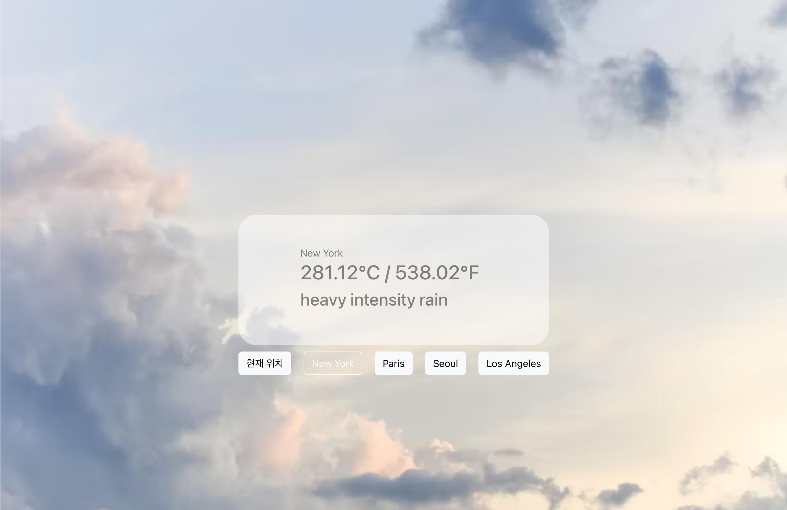

# 날씨 앱 (Weather App)

이 프로젝트는 React를 사용하여 구현된 날씨 정보 앱입니다. 사용자는 현재 위치의 날씨를 확인할 수 있으며, 세계 각지의 다른 도시들에 대한 날씨 정보를 조회할 수 있습니다.

## 기능

- 현재 위치의 지역명, 온도, 날씨 상태 표시
- 다른 도시들에 대한 버튼 제공
- 도시 버튼 클릭 시 해당 도시의 날씨 정보 표시
- 데이터 로딩 중 로딩 스피너 표시

## 사용된 기술

- React
- Javascript
- CSS (React Bootstrap)

## API

이 앱은
OpenWeatherMap API
를 사용하여 실시간 날씨 데이터를 가져옵니다. API 키를 발급받아 사용해야 합니다.

## 스크린샷

